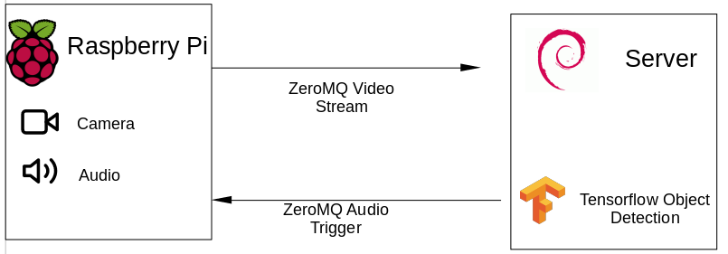
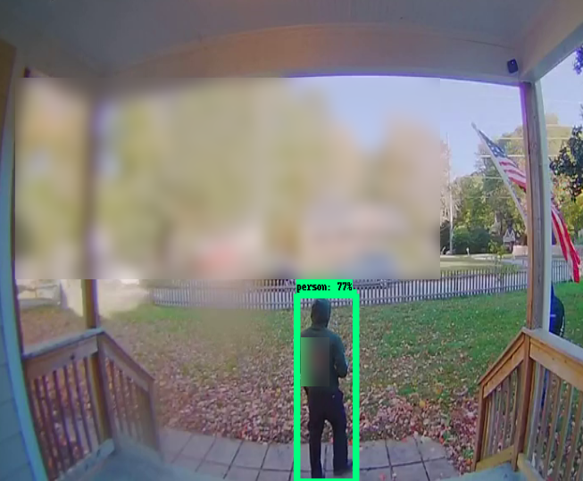
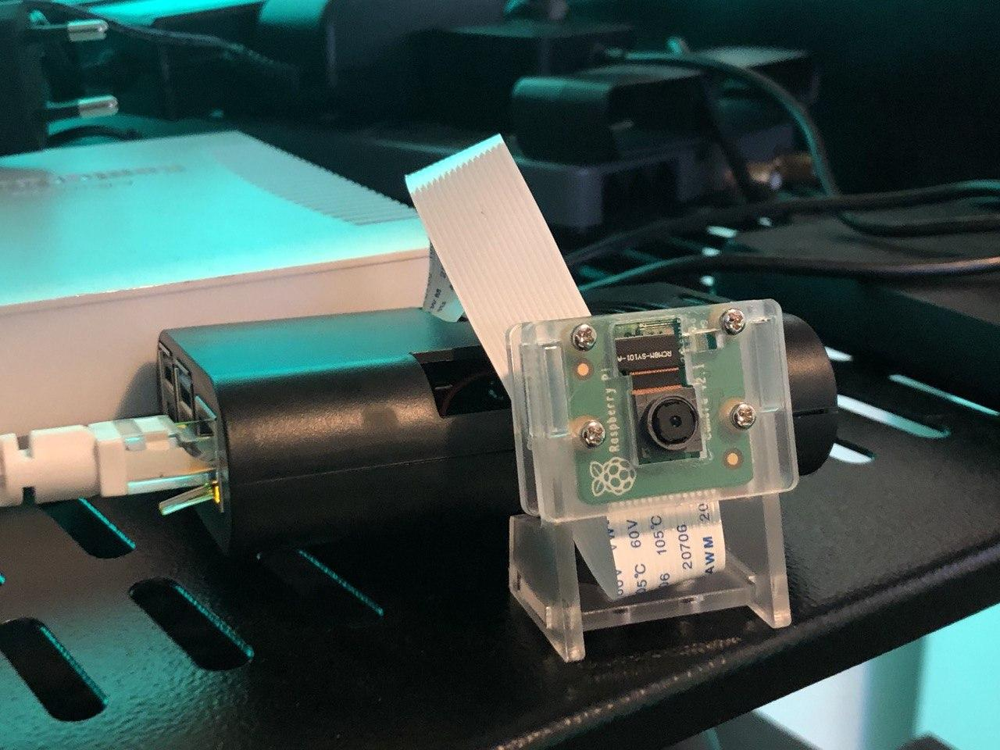

# Scarecrow-Cam
A `Raspberry Pi` powered edge-computing camera setups that runs a `Tensorflow` object detection model to determine whether a person is on the camera and plays loud audio to scare them off. 

*Based on my [blog](https://chollinger.com/blog/2019/12/tensorflow-on-edge-building-a-smar-security-camera-with-a-raspberry-pi/).*

## Architecture




The setup shown here only fits the use-case of `edge` to a degree, as we run local detection on a separate machine; technically, the Raspberry Pi is capable of running Tensorflow on board, e.g. through `TFLite` or `esp32cam`. 

You can change this behavior by relying on a local `tensorflor` instance and having the `ZMQ` communication run over `localhost`.

## Requirements
This project requires:
* A Raspberry Pi + the camera module v2 (the `client`) 
* Any Linux machine on the same network (the `server`)



## Install

```
bash ./sbin/install_tf_vidgear.sh [server/client]
```

Please see [INSTALL.md](./INSTALL.md) for details.

## Configuration and data

**Use a virtual environment**
```
python3 -m venv env
source env/bin/activate
```

Edit the `conf/config.ini` with the settings for your Raspberry and server.

For playing audio, please adjust

```
[Audio]
Path=../audio_files
```
For an appropriate path.


## Run

### On the raspberry
```
python3 $PROJECT_LOCATION/client/sender.py --input 0 # for picam
python3 $PROJECT_LOCATION/client/sender.py --input '/path/to/video' # for local video
```

### On the server
```
python3 $PROJECT_LOCATION/server/receiver.py
```

## License
This project is licensed under the GNU GPLv3 License - see the [LICENSE](LICENSE) file for details.